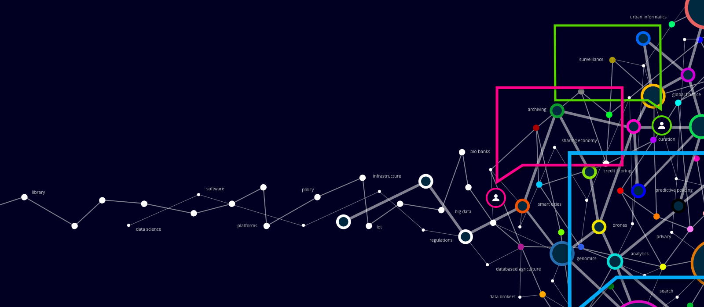

  

# Eduardo Scovino
*Data Consultant*

Hi, evebody! Welcome to my portfolio page!

I am a senior data consultant with 6 years of experience working on consulting firms and my expertise industry is in Telecom Industry (I'm open to know more about other industries as well)

Having spend the last years working with data treatment and visualization, I developed a critical thinking and problem-solving skills.

My credentials include a Chemical Engineering Bachelor (engineers are everywhere, working with evertything xD) and a Web Development Bootcamp Certificate from Le Wagon, one of the best coding schools in the world.

**Background in:** Python, SQL, Tableau and Power BI.

**Links:**
* [LinkedIn](https://https://www.linkedin.com/in/eduardo-scovino-943461b8/)
* [Medium](https://medium.com/@eduardoscovino)

## Projects:
* [Airbnb Analysis in Sicily](https://github.com/eduardoscovino/Airbnb-data-analysis-sicilia) (in Portuguese)
* [Pokemon Analysis](https://github.com/eduardoscovino/Pokemon-analysis)
---
